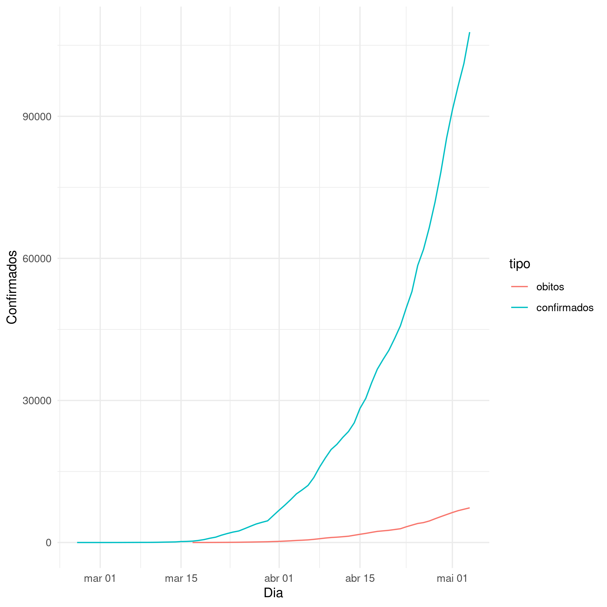
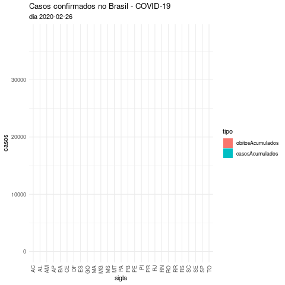
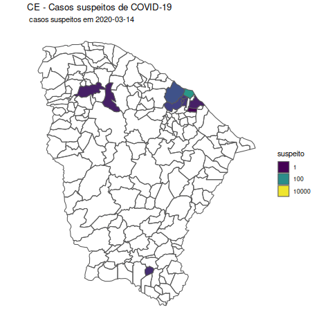
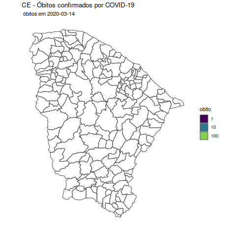

# Número de casos do COVID-19 no Brasil

Esse repositório é um esforço no sentido de preservar banco de dados da
evolução na quantidade no número de casos do COVID-19 no Brasil. Comecei a
coletar os dados do ministério da saúde a partir de 14 de março. Para conseguir
os dados anteriores, procurei em grandes portais de notícia. Detalhes sobre
isso podem ser encontrados na pasta `dados/`

Depois de algumas semanas, o Ministério da Saúde passou a disponilizar os
mesmos dados em um arquivo csv. Esses são os dados que estão sendo usados agora

Uma parte dos gráficos foi feita com animações, de modo que possa ter maior
impacto, mostrando as pessoas o quão rápido o número de casos vêm aumentando.

## Requisitos (Ubuntu 18.04)
- Para compilar pacotes
`sudo apt install r-base-dev`
- libudunits2
`sudo apt install libudunits2-dev`
- gdal
`sudo apt install libgdal-dev libmagick++-dev` 
- libsodium
`sudo apt install libsodium-dev`
- libproj
`sudo apt install libproj-dev`
- libgfortran
`sudo apt install libgfortran4`
- pacote sf
`install.package('sf')`

## Gráficos sem animação

## Gráficos com animação

### Mesmo gráfico mostrado no tópido anterior, mas animado

### Número de casos por estado

### Número de casos por estado e tempo

### Força de infecção, Lambra, Brasil

## Ceará

### Número de casos suspeitos por município e tempo

### Número de casos confirmados por município e tempo

### Número de óbitos por município e tempo

## Observações
- Dados de Brasil provêm do Ministério da Saúde
- Dados do Ceará são de origem da Secretaria de Saúde do Estado do Ceará
