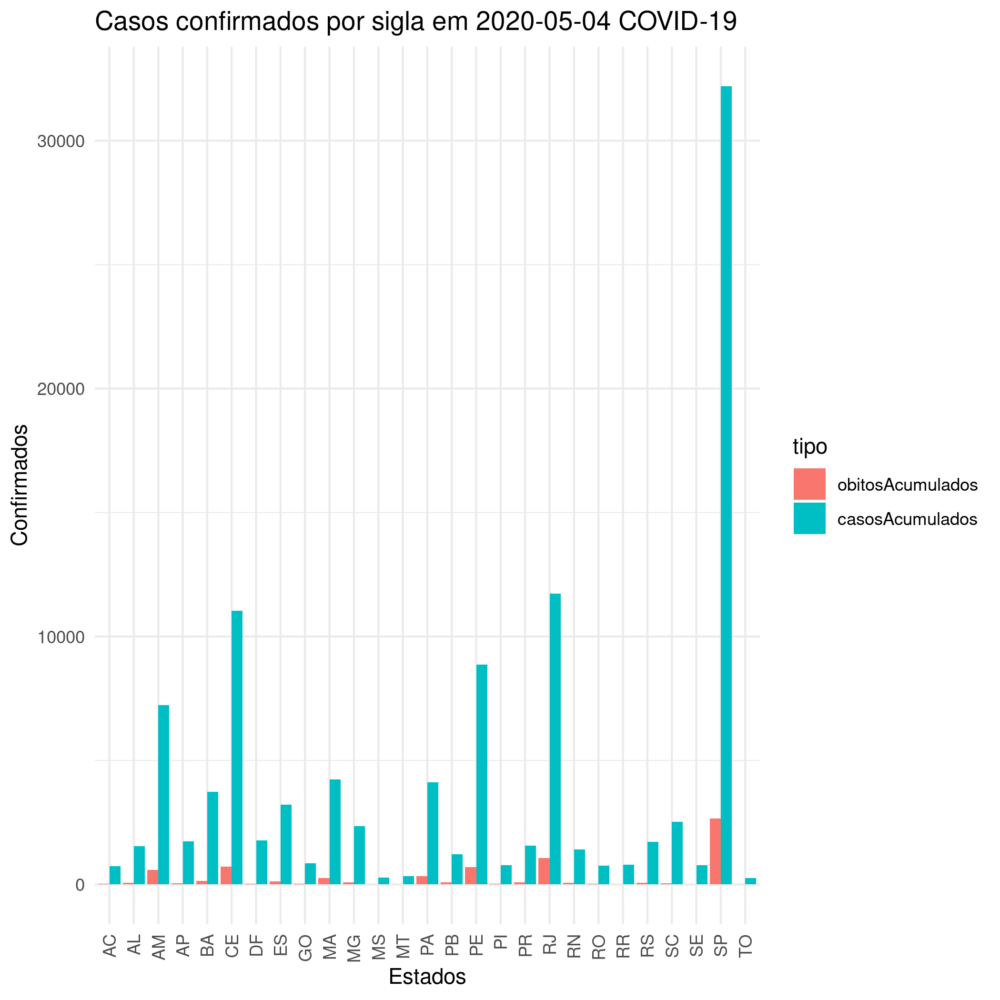
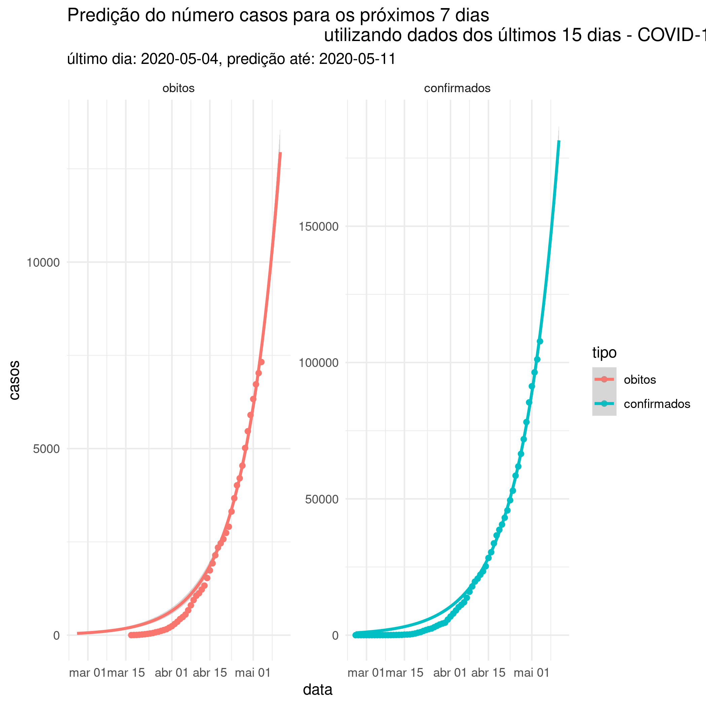
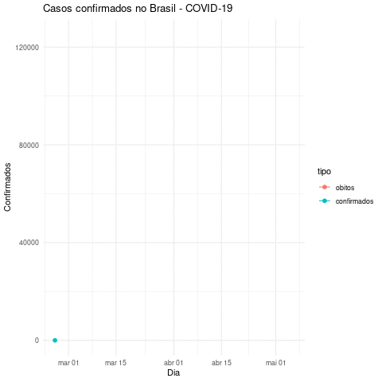

# Número de casos do COVID-19 no Brasil

Esse repositório é um esforço no sentido de preservar banco de dados da
evolução na quantidade no número de casos do COVID-19 no Brasil. Comecei a
coletar os dados do ministério da saúde a partir de 14 de março. Para conseguir
os dados anteriores, procurei em grandes portais de notícia. Detalhes sobre
isso podem ser encontrados na pasta `dados/`

Uma parte dos gráficos foi feita com animações, de modo que possa ter maior
impacto, mostrando as pessoas o quão rápido o número de casos vêm aumentando.

## Gráficos sem animação

## Predição do número de casos para a próxima semana

## Gráficos com animação

### Mesmo gráfico mostrado no tópido anterior, mas animado

### Número de casos por estado

### Número de casos por estado e tempo, escala de cor

## Observações
- Vou tentar manter atualizado, tão logo o Ministério da Saúde continue
  liberando as tabelas com número de casos
